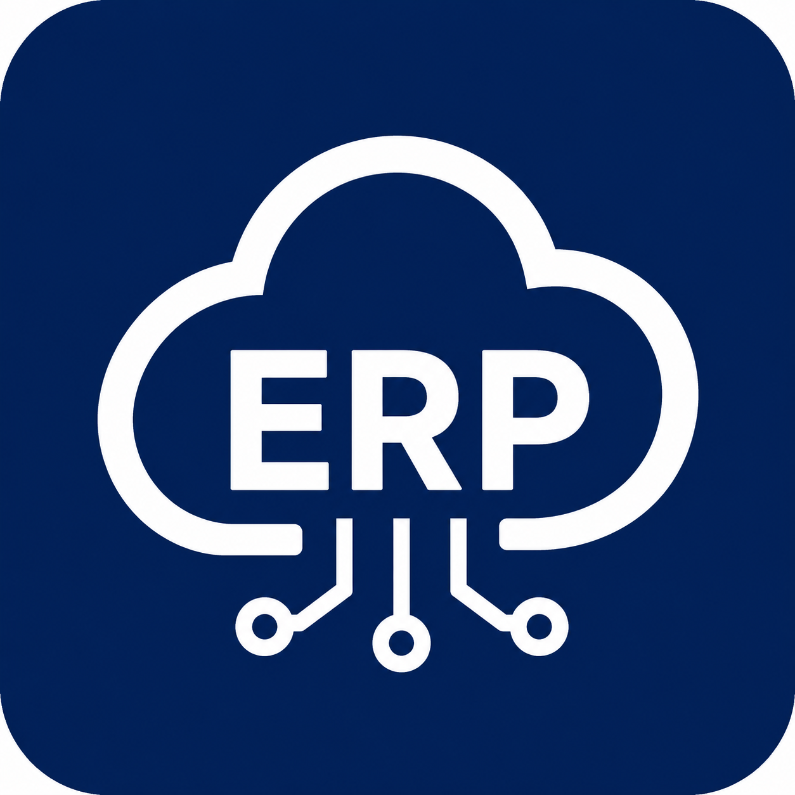
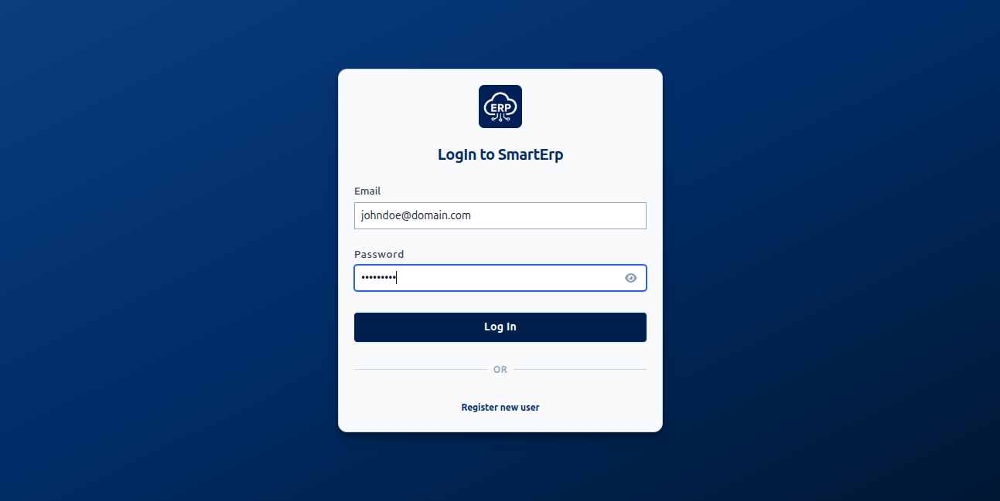
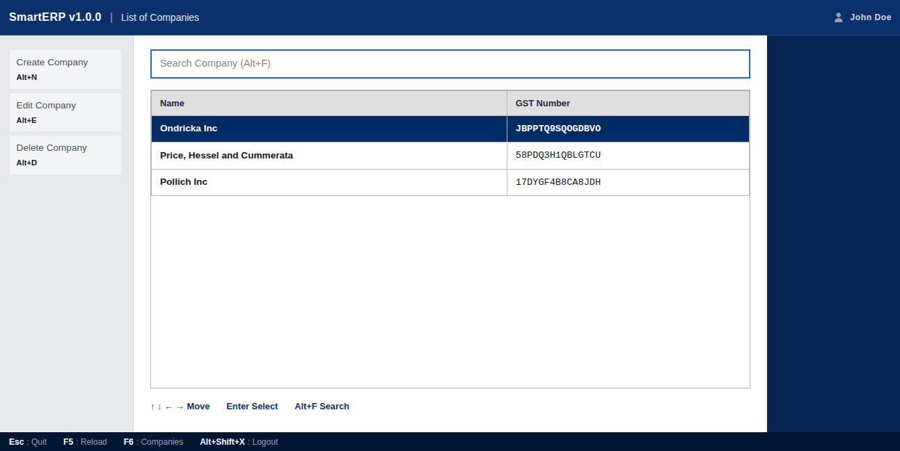
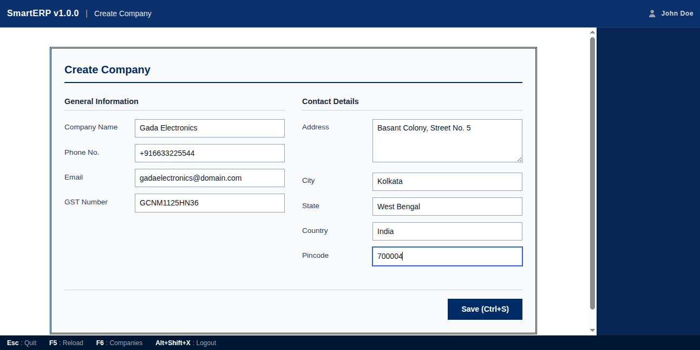
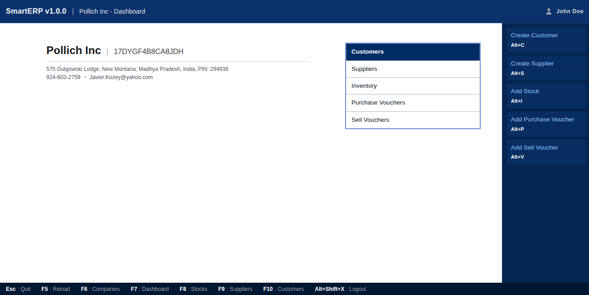
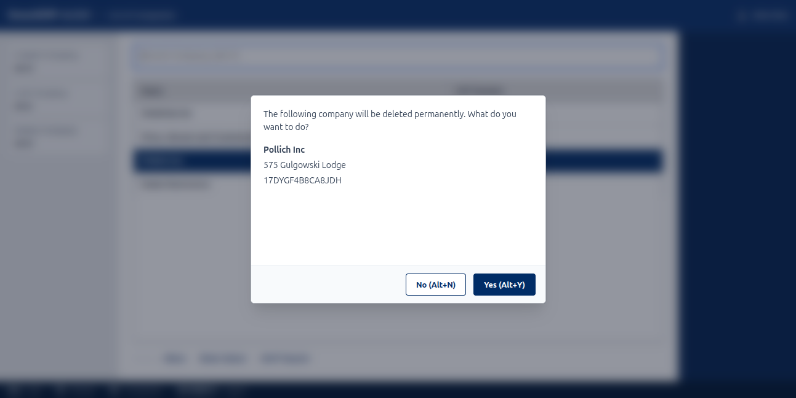

<p align="center">
  
</p>

<h1 align="center">SmartERP</h1>

<p align="center">
  <strong>A modern, cloud-based ERP and accounting platform inspired by TallyPrime.</strong>
</p>

SmartERP is a modern business management platform designed to streamline accounting, inventory, billing, and financial reporting within a single cloud-based system.

### 🌟 Key Features & USPs
*   **Complete Cloud ERP**: Unlike traditional local ERP systems that restrict data access to a single local machine, SmartERP is fully cloud-based, secure, and accessible from any web browser anywhere in the world.
*   **Complete Keyboard Navigation**: Engineered with a keyboard-first workflow inspired by TallyPrime, enabling accountants and operators to manage companies, ledgers, vouchers, and generate invoices at lightning speed without ever touching a mouse.

---

## 🔗 Live Demo

Experience the live application here: [smart-erp-rahulstech.vercel.app](https://smart-erp-rahulstech.vercel.app)

> ⚠️ **Note**: Since the backend is deployed on a free instance of **Render**, the service automatically spins down after a period of inactivity. As a result, the initial API request may take **50–60 seconds** to respond. Please have patience on your first access while the server boots back up!

---

## 📸 Screenshots

Here are some screenshots demonstrating the application's key workflows:

*   **User Login**: The secure authentication gateway for the platform.
    
*   **Company Directory**: A clean dashboard listing all user-managed companies.
    
*   **Create Company Form**: Intuitive wizard to register a new organization profile.
    
*   **Company Dashboard**: Main operations panel with quick access KPI metrics.
    
*   **Safety Confirmations**: Double-check prompts preventing accidental data deletion.
    

---

## 💻 Tech Stack

### Backend
*   **Java 21 & Spring Boot 3**: Serves as a robust, enterprise-grade, and secure foundation for building high-performance REST APIs.
*   **Spring Security**: Handles stateless user authentication, resource authorization, and endpoint security.
*   **Spring Data JPA (Hibernate)**: Simplifies database communication by mapping Java objects directly to PostgreSQL relational tables.
*   **iText PDF**: Generates print-ready, professional PDF invoices and accounting statements dynamically.
*   **Auth0 Java-JWT**: Creates, signs, and decodes JSON Web Tokens (JWT) for secure, stateless API sessions.
*   **Lombok**: Eliminates boilerplate Java code (getters, setters, builders, constructors) to keep the codebase clean.

### Frontend
*   **React & Vite**: Delivers a highly responsive and fast user interface using modular components and modern asset compilation.
*   **React Router DOM**: Facilitates fast, declarative, and seamless client-side page routing and navigation.
*   **TanStack React Query**: Manages efficient client-side caching, data fetching, and automated server-state updates.
*   **TanStack React Table**: Renders customizable, high-performance tabular data grids ideal for accounting ledgers.
*   **Axios**: Provides an easy-to-use promise-based HTTP client to make request calls to the backend REST API.
*   **Tailwind CSS**: Powers modern utility-first CSS styling to craft visually stunning and responsive user interfaces.
*   **FontAwesome & Lucide React**: Supplies clean, scalable vector icons to enhance page layouts and button actions.

### Database
*   **PostgreSQL**: Provides a highly reliable, ACID-compliant relational database management system to secure transactional enterprise data.

---

## 🛠️ Run Locally

Follow these step-by-step instructions to set up SmartERP on your local machine.

### 1. Clone the Repository
```bash
git clone https://github.com/rahulstech/smart-erp-java-spring-react.git
cd smart-erp-java-spring-react
```

### 2. Set Up Local PostgreSQL (Version 16+)
SmartERP requires PostgreSQL 16 or above. You can install it on your OS or spin up a PostgreSQL instance using **Docker**:
```bash
docker run --name smart-erp-db \
  -e POSTGRES_DB=db_smart_erp \
  -e POSTGRES_USER=postgres \
  -e POSTGRES_PASSWORD=postgres \
  -p 5432:5432 \
  -d postgres:16
```
To verify that the database container is running, execute:
```bash
docker ps
```

### 3. Backend Setup
1.  Navigate to the `backend` folder:
    ```bash
    cd backend
    ```
2.  Copy the example environment file to `.env`:
    ```bash
    cp .env.example .env
    ```
3.  Edit the `.env` file to configure your local credentials:

| Variable | Description |
| :--- | :--- |
| `DB_NAME` | The name of the database (e.g., `db_smart_erp`). |
| `DB_USER` | The database connection username (e.g., `postgres`). |
| `DB_PASSWORD` | The database connection password (e.g., `postgres`). |
| `DB_HOST` | Host address of the database (e.g., `localhost`). |
| `DB_PORT` | Port of the database (e.g., `5432`). |
| `DB_SSL` | SSL connection mode (`disable`, `required`, `verify-full`). Set to `disable` for local development. |
| `DB_CERT_PATH` | Path to the CA certificate file (only required if SSL is enabled). |
| `AUTH_JWT_SECRET` | A secure 256-bit (32-byte) key for signing and verifying JWT tokens. |
| `CORS_ALLOWED_ORIGINS` | Allowed origin patterns for cross-resource sharing (e.g., `http://localhost:*`). Maps to `CORS_ALLOWED_ORIGINS` in properties. |
| `SPRING_PROFILE` | Active Spring profile. Use `dev` for development or `prod` for production. |

#### 🔑 Generating a JWT Secret Key on Linux
To create a secure 256-bit hex secret key for your `AUTH_JWT_SECRET`, run the following command in your terminal:
```bash
openssl rand -hex 32
```
Copy the generated string and set it as the value of `AUTH_JWT_SECRET` in your `.env` file.

#### Run the Spring Boot App
Start the backend server by loading your environment variables and running Gradle:
```bash
export $(grep -v '^#' .env | xargs) && ./gradlew bootRun
```

### 4. Frontend Setup
1.  Navigate to the `frontend` folder:
    ```bash
    cd ../frontend
    ```
2.  Copy the example environment file to `.env.local`:
    ```bash
    cp .env-example .env.local
    ```
3.  Ensure `VITE_API_BASE_URL` points to your local backend API server:
    ```properties
    VITE_API_BASE_URL=http://localhost:8080/api
    ```
4.  Install dependencies:
    ```bash
    npm install
    ```
5.  To start the development server:
    ```bash
    npm run dev
    ```
6.  To build the frontend project for production:
    ```bash
    npm run build
    ```

---

## 🌐 Deployment Details

*   **Backend**: Deployed on **Render** via a Docker container. The published image is available on Docker Hub at: [rahulstech/smart-erp](https://hub.docker.com/r/rahulstech/smart-erp).
*   **Frontend**: Deployed on **Vercel** at: [smart-erp-rahulstech.vercel.app](https://smart-erp-rahulstech.vercel.app).
*   **Database**: Deployed on **Aiven** running a managed **PostgreSQL 17** instance.

---

## 📈 Real World Scope & Industry Relevance

SmartERP is modeled after leading commercial solutions like **TallyPrime**, **Zoho Books**, and **SAP Business One** to address real-world business automation and accounting needs.

*   **Broad Industry Applicability**: Designed to serve diverse sectors including Retail, Manufacturing, Wholesalers, Distributors, and Chartered Accountant (CA) firms by streamlining multi-company ledger management, dual-entry vouchers, stock tracking, and GST compliance.
*   **Enterprise-Grade Engineering**: Demonstrates key architectural competencies required by software vendors, including double-entry financial workflows, complex relational database schemas, multi-module setups, and a highly responsive keyboard-first user interface.

---

## 👥 Developer Contact

*   **LinkedIn**: [iamrahulbagchi](https://www.linkedin.com/in/iamrahulbagchi/)
*   **Email**: [rahulstech18@gmail.com](mailto:rahulstech18@gmail.com)
